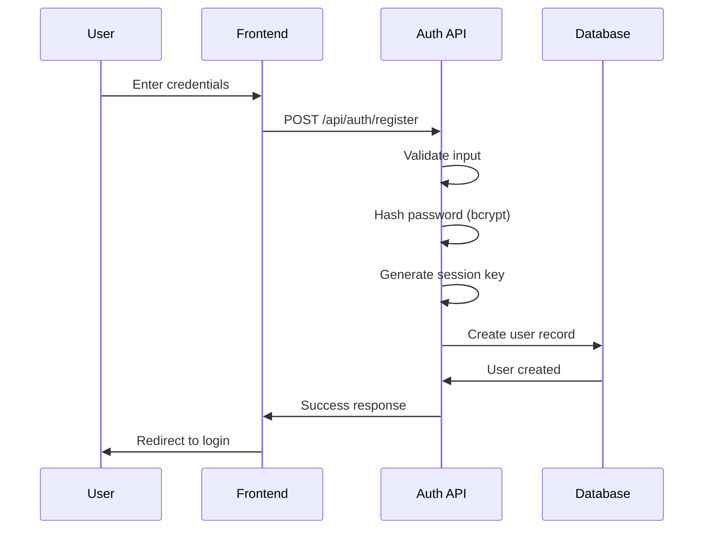
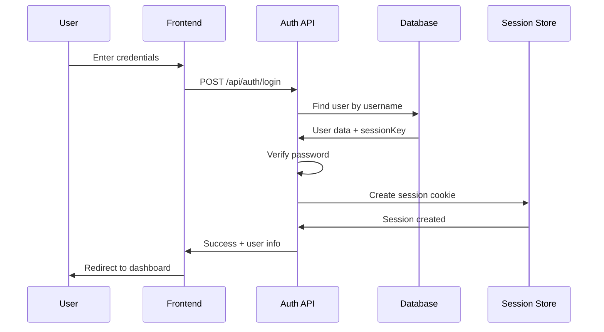
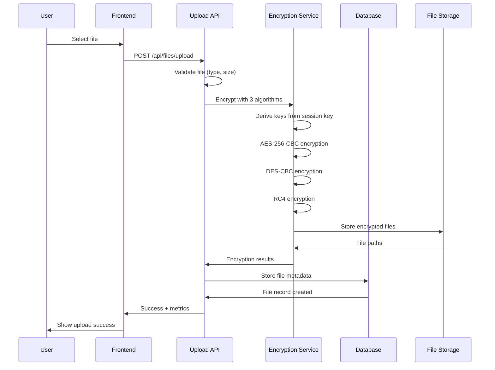
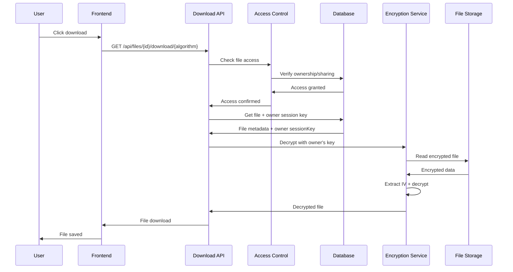
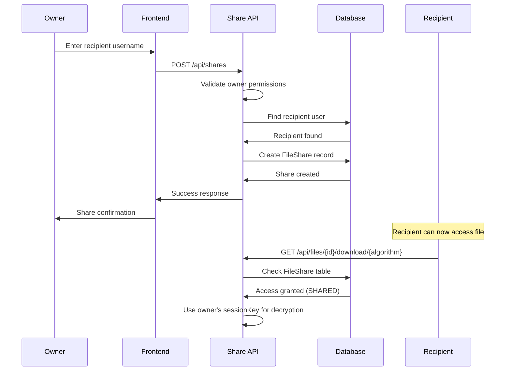

# Secure File Exchange System - Technical Documentation

## Table of Contents
1. [Architecture Overview](#architecture-overview)
2. [Authentication Flow](#authentication-flow)
3. [File Encryption & Decryption Flow](#file-encryption--decryption-flow)
4. [File Sharing Flow](#file-sharing-flow)
5. [Key Management System](#key-management-system)
6. [Database Schema](#database-schema)
7. [API Endpoints](#api-endpoints)
8. [Frontend Components](#frontend-components)
9. [Security Implementation](#security-implementation)
10. [Performance Monitoring](#performance-monitoring)

## Architecture Overview

The Secure File Exchange System is built using a modern full-stack architecture:

```
┌─────────────────┐    ┌─────────────────┐    ┌─────────────────┐
│   Frontend      │    │   Backend API   │    │   Database      │
│   (Next.js)     │◄──►│   (Next.js API) │◄──►│   (MySQL)       │
│                 │    │                 │    │                 │
│ - React Pages   │    │ - Auth Routes   │    │ - User Data     │
│ - UI Components │    │ - File Routes   │    │ - File Metadata │
│ - Client Logic  │    │ - Encryption    │    │ - Encrypted Data│
└─────────────────┘    └─────────────────┘    └─────────────────┘
                                │
                                ▼
                       ┌─────────────────┐
                       │  File Storage   │
                       │  (Local/Cloud)  │
                       │                 │
                       │ - Encrypted     │
                       │   Files         │
                       └─────────────────┘
```

### Key Technologies
- **Frontend**: Next.js 14+ with App Router, React, TypeScript, TailwindCSS
- **Backend**: Next.js API Routes, Prisma ORM
- **Database**: MySQL with Prisma schema
- **Authentication**: iron-session with bcrypt
- **Encryption**: Node.js crypto module (AES, DES) + crypto-js (RC4)
- **File Processing**: Sharp for images, XLSX for Excel files

## Authentication Flow

### 1. User Registration
**Files Involved:**
- `app/register/page.tsx` - Registration UI
- `app/api/auth/register/route.ts` - Registration API
- `lib/auth/password.ts` - Password hashing
- `lib/auth/session.ts` - Session key generation

**Flow:**


**Code Path:**
1. `app/register/page.tsx` - User fills registration form
2. `app/api/auth/register/route.ts` - Validates input, hashes password
3. `lib/auth/password.ts` - Uses bcrypt with 12 salt rounds
4. `lib/auth/session.ts` - Generates 256-bit session key
5. `prisma/schema.prisma` - Stores user with sessionKey

### 2. User Login
**Files Involved:**
- `app/login/page.tsx` - Login UI
- `app/api/auth/login/route.ts` - Login API
- `lib/auth/session.ts` - Session management

**Flow:**


**Key Features:**
- **Persistent Session Keys**: Users retain the same session key across logins
- **Secure Cookies**: iron-session with encryption
- **Password Verification**: bcrypt comparison

### 3. Session Management
**Files Involved:**
- `lib/auth/session.ts` - Session utilities
- `lib/auth/index.ts` - Auth exports

**Session Data Structure:**
```typescript
interface SessionData {
  userId: string;
  username: string;
  sessionKey: string; // Base64 encoded encryption key
  isLoggedIn: boolean;
}
```

## File Encryption & Decryption Flow

### 1. File Upload & Encryption
**Files Involved:**
- `app/upload/page.tsx` - Upload UI
- `app/api/files/upload/route.ts` - Upload API
- `lib/services/file-encryption-orchestrator.ts` - Encryption orchestration
- `lib/encryption/` - Encryption implementations

**Flow:**


**Key Derivation Process:**
```typescript
// In lib/encryption/key-manager.ts
static deriveFileKey(sessionKey: Buffer, fileId: string, algorithm: Algorithm): Buffer {
  const hmac = crypto.createHmac('sha256', sessionKey);
  hmac.update(fileId);
  hmac.update(algorithm);
  const derivedHash = hmac.digest();
  return derivedHash.subarray(0, keySize); // Truncate to algorithm key size
}
```

**File Storage Structure:**
```
uploads/
├── aes/
│   └── {fileId}.enc
├── des/
│   └── {fileId}.enc
└── rc4/
    └── {fileId}.enc
```

### 2. File Download & Decryption
**Files Involved:**
- `app/api/files/[id]/download/[algorithm]/route.ts` - Download API
- `lib/services/access-control.ts` - Access verification
- `lib/services/file-encryption-orchestrator.ts` - Decryption

**Flow:**


**Critical Security Feature:**
- **Owner's Session Key**: Always uses the file owner's session key for decryption, not the current user's
- **Access Control**: Verifies user has permission before decryption
- **Algorithm Flexibility**: Supports AES, DES, or RC4 decryption

## File Sharing Flow

### 1. Share File with User
**Files Involved:**
- `app/files/[id]/share/page.tsx` - Share UI
- `app/api/shares/route.ts` - Share API
- `lib/services/access-control.ts` - Access management

**Flow:**


### 2. Access Control System
**Files Involved:**
- `lib/services/access-control.ts` - Access verification logic

**Access Types:**
```typescript
export type AccessType = 'OWNER' | 'SHARED' | 'NONE';

export interface AccessCheck {
  hasAccess: boolean;
  accessType: AccessType;
}
```

**Access Verification Logic:**
1. **Owner Check**: User owns the file directly
2. **Share Check**: File is shared with user via FileShare table
3. **Deny**: No access found

## Key Management System

### 1. Session Key Generation
**Files Involved:**
- `lib/auth/session.ts` - Session key generation
- `lib/encryption/key-manager.ts` - Key derivation utilities

**Session Key Properties:**
- **Size**: 256 bits (32 bytes)
- **Encoding**: Base64 for storage
- **Persistence**: Stored in database, consistent across logins
- **Uniqueness**: Each user has a unique session key

### 2. File Key Derivation
**Algorithm-Specific Key Sizes:**
- **AES**: 256 bits (32 bytes)
- **DES**: 192 bits (24 bytes) - 3DES
- **RC4**: 128 bits (16 bytes)

**Derivation Formula:**
```
FileKey = HMAC-SHA256(UserSessionKey, FileID + Algorithm)[0:KeySize]
```

### 3. Key Security Features
- **No Hard-coded Keys**: All keys are generated or derived
- **Deterministic**: Same inputs always produce same keys
- **Algorithm-specific**: Each algorithm gets a unique key per file
- **User-specific**: Each user's session key is unique

## Database Schema

### Core Tables

#### User Table
```sql
CREATE TABLE User (
    id VARCHAR(191) PRIMARY KEY,
    username VARCHAR(191) UNIQUE NOT NULL,
    passwordHash VARCHAR(191) NOT NULL,
    sessionKey VARCHAR(191), -- Base64 encoded session key
    createdAt DATETIME(3) DEFAULT CURRENT_TIMESTAMP(3),
    updatedAt DATETIME(3) NOT NULL
);
```

#### File Table
```sql
CREATE TABLE File (
    id VARCHAR(191) PRIMARY KEY,
    userId VARCHAR(191) NOT NULL,
    originalName VARCHAR(191) NOT NULL,
    fileType ENUM('EXCEL', 'IMAGE') NOT NULL,
    uploadedAt DATETIME(3) DEFAULT CURRENT_TIMESTAMP(3),
    aesPath VARCHAR(191) NOT NULL,
    desPath VARCHAR(191) NOT NULL,
    rc4Path VARCHAR(191) NOT NULL,
    originalSize INTEGER NOT NULL,
    mimeType VARCHAR(191) NOT NULL,
    FOREIGN KEY (userId) REFERENCES User(id)
);
```

#### FileShare Table
```sql
CREATE TABLE FileShare (
    id VARCHAR(191) PRIMARY KEY,
    fileId VARCHAR(191) NOT NULL,
    ownerId VARCHAR(191) NOT NULL,
    sharedWithUserId VARCHAR(191) NOT NULL,
    sharedAt DATETIME(3) DEFAULT CURRENT_TIMESTAMP(3),
    FOREIGN KEY (fileId) REFERENCES File(id),
    FOREIGN KEY (ownerId) REFERENCES User(id),
    FOREIGN KEY (sharedWithUserId) REFERENCES User(id),
    UNIQUE(fileId, sharedWithUserId)
);
```

#### EncryptionMetric Table
```sql
CREATE TABLE EncryptionMetric (
    id VARCHAR(191) PRIMARY KEY,
    fileId VARCHAR(191) NOT NULL,
    algorithm ENUM('AES', 'DES', 'RC4') NOT NULL,
    encryptionTime DOUBLE NOT NULL,
    decryptionTime DOUBLE,
    ciphertextSize INTEGER NOT NULL,
    dataType ENUM('NUMERICAL', 'SPREADSHEET', 'IMAGE') NOT NULL,
    createdAt DATETIME(3) DEFAULT CURRENT_TIMESTAMP(3),
    FOREIGN KEY (fileId) REFERENCES File(id)
);
```

## API Endpoints

### Authentication Endpoints
| Method | Endpoint | Description | File |
|--------|----------|-------------|------|
| POST | `/api/auth/register` | User registration | `app/api/auth/register/route.ts` |
| POST | `/api/auth/login` | User login | `app/api/auth/login/route.ts` |
| POST | `/api/auth/logout` | User logout | `app/api/auth/logout/route.ts` |
| GET | `/api/auth/session` | Get current session | `app/api/auth/session/route.ts` |

### File Management Endpoints
| Method | Endpoint | Description | File |
|--------|----------|-------------|------|
| POST | `/api/files/upload` | Upload & encrypt file | `app/api/files/upload/route.ts` |
| GET | `/api/files` | List user's files | `app/api/files/route.ts` |
| GET | `/api/files/[id]/download/[algorithm]` | Download & decrypt file | `app/api/files/[id]/download/[algorithm]/route.ts` |
| GET | `/api/files/[id]/thumbnail` | Generate image thumbnail | `app/api/files/[id]/thumbnail/route.ts` |
| GET | `/api/files/[id]/report` | Get financial report | `app/api/files/[id]/report/route.ts` |
| DELETE | `/api/files/[id]/delete` | Delete file | `app/api/files/[id]/delete/route.ts` |

### File Sharing Endpoints
| Method | Endpoint | Description | File |
|--------|----------|-------------|------|
| POST | `/api/shares` | Share file with user | `app/api/shares/route.ts` |
| GET | `/api/shares/sent` | List sent shares | `app/api/shares/sent/route.ts` |
| GET | `/api/shares/received` | List received shares | `app/api/shares/received/route.ts` |
| DELETE | `/api/shares/[id]` | Remove file share | `app/api/shares/[id]/route.ts` |

### Metrics Endpoints
| Method | Endpoint | Description | File |
|--------|----------|-------------|------|
| GET | `/api/metrics/algorithms` | Algorithm performance | `app/api/metrics/algorithms/route.ts` |
| GET | `/api/metrics/performance` | System performance | `app/api/metrics/performance/route.ts` |
| GET | `/api/metrics/user/[userId]` | User-specific metrics | `app/api/metrics/user/[userId]/route.ts` |

## Frontend Components

### Page Components
| Page | File | Description |
|------|------|-------------|
| Login | `app/login/page.tsx` | User authentication |
| Register | `app/register/page.tsx` | User registration |
| Dashboard | `app/dashboard/page.tsx` | Main dashboard |
| Upload | `app/upload/page.tsx` | File upload interface |
| Metrics | `app/metrics/page.tsx` | Performance analytics |
| File Share | `app/files/[id]/share/page.tsx` | Share file with users |
| Financial Report | `app/files/[id]/report/page.tsx` | View encrypted reports |

### UI Components
| Component | File | Purpose |
|-----------|------|---------|
| Button | `components/ui/button.tsx` | Reusable button component |
| Input | `components/ui/input.tsx` | Form input component |
| Card | `components/ui/card.tsx` | Content container |
| Alert | `components/ui/alert.tsx` | Notification component |
| Theme Toggle | `components/ui/theme-toggle.tsx` | Dark/light mode switch |

### Key Frontend Features
- **Responsive Design**: TailwindCSS with mobile-first approach
- **Dark Mode**: Theme switching capability
- **Form Validation**: Client-side validation with error handling
- **File Upload**: Drag-and-drop with progress indicators
- **Real-time Metrics**: Performance charts and statistics

## Security Implementation

### 1. Password Security
**File**: `lib/auth/password.ts`
- **Hashing**: bcrypt with 12 salt rounds
- **No Plain Text**: Passwords never stored in plain text
- **Secure Comparison**: Constant-time comparison

### 2. Session Security
**File**: `lib/auth/session.ts`
- **Encryption**: iron-session with AES encryption
- **HttpOnly Cookies**: Prevents XSS attacks
- **Secure Cookies**: HTTPS-only in production
- **SameSite**: CSRF protection

### 3. File Encryption Security
**Files**: `lib/encryption/`
- **AES-256-CBC**: Industry standard with random IVs
- **Key Derivation**: HMAC-SHA256 for deterministic keys
- **No Key Reuse**: Each file gets unique keys per algorithm
- **Secure Random**: Cryptographically secure random number generation

### 4. Access Control Security
**File**: `lib/services/access-control.ts`
- **Ownership Verification**: Users can only access owned/shared files
- **Database-level Checks**: All access verified against database
- **Principle of Least Privilege**: Minimal required permissions

### 5. Input Validation
- **File Type Validation**: Only allowed MIME types
- **File Size Limits**: Configurable maximum file sizes
- **SQL Injection Prevention**: Prisma ORM with parameterized queries
- **XSS Prevention**: Input sanitization and CSP headers

## Performance Monitoring

### 1. Encryption Metrics
**File**: `lib/services/file-metadata-service.ts`
- **Encryption Time**: Millisecond precision timing
- **Decryption Time**: Performance tracking
- **Ciphertext Size**: Storage efficiency metrics
- **Algorithm Comparison**: Side-by-side performance data

### 2. System Metrics
**Files**: `app/api/metrics/`
- **User Activity**: Upload/download statistics
- **Algorithm Usage**: Most/least used algorithms
- **File Type Distribution**: Excel vs Image usage
- **Performance Trends**: Historical performance data

### 3. Logging System
**File**: `lib/logger.ts`
- **Authentication Events**: Login/logout tracking
- **File Operations**: Upload/download/share events
- **Encryption Operations**: Success/failure logging
- **Error Tracking**: Detailed error information

## Error Handling

### 1. Global Error Handler
**File**: `lib/error-handler.ts`
- **Consistent Error Format**: Standardized error responses
- **Error Classification**: Authentication, validation, encryption errors
- **Logging Integration**: All errors logged with context
- **User-friendly Messages**: Technical details hidden from users

### 2. Error Types
```typescript
// Authentication Errors
createAuthenticationError('UNAUTHORIZED', 'Authentication required')

// Validation Errors  
createValidationError('INVALID_FILE_TYPE', 'Only Excel and images allowed')

// Encryption Errors
createEncryptionError('DECRYPTION_FAILED', 'Failed to decrypt file')

// Not Found Errors
createNotFoundError('FILE_NOT_FOUND', 'File not found or access denied')
```

## Development & Deployment

### 1. Development Setup
**Files**: `package.json`, `next.config.ts`
- **Hot Reload**: Next.js development server
- **TypeScript**: Full type safety
- **ESLint**: Code quality enforcement
- **Prettier**: Code formatting

### 2. Testing
**Files**: `test/`
- **Unit Tests**: Vitest with Testing Library
- **Integration Tests**: API endpoint testing
- **Encryption Tests**: Algorithm verification
- **Authentication Tests**: Session management testing

### 3. Deployment
**Files**: `scripts/deploy-*.sh`
- **VPS Deployment**: Automated deployment scripts
- **Docker Support**: Containerized deployment option
- **Database Migration**: Prisma migration system
- **Environment Configuration**: Secure environment variable management

This technical documentation provides a comprehensive overview of how the Secure File Exchange System works, from authentication flows to encryption mechanisms, making it easier for developers to understand and maintain the codebase.